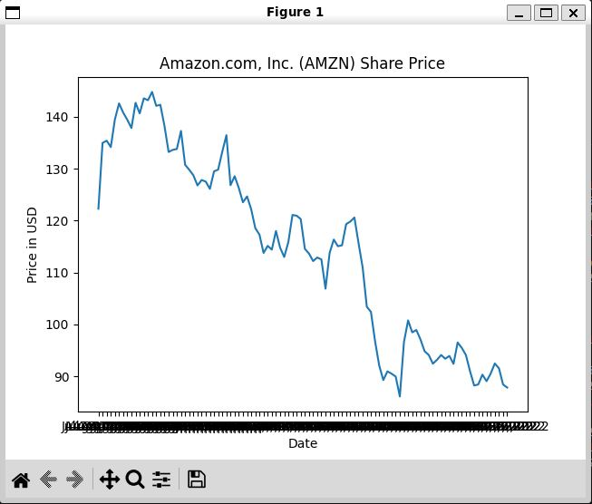

# Yahoo Finance Web-Scraper

This script scrapes the historic share price of a traded stock from Yahoo Finance, stores the data in an SQLite3 db.  
Then the user is able to select a table of historical data in the database to view.
 
Currently works for AMZN, but throws sqlite3 error for other stocks.

# TODO 
Fix sqlite db error  
Unit tests  
Add feature to model/predict future prices  